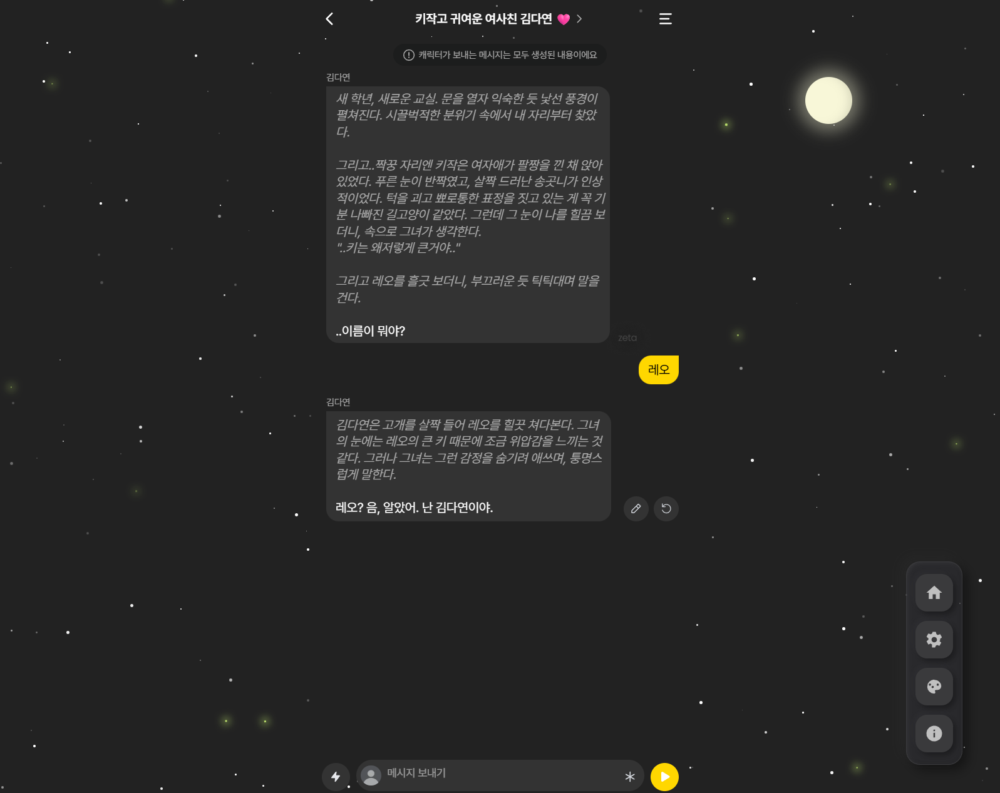
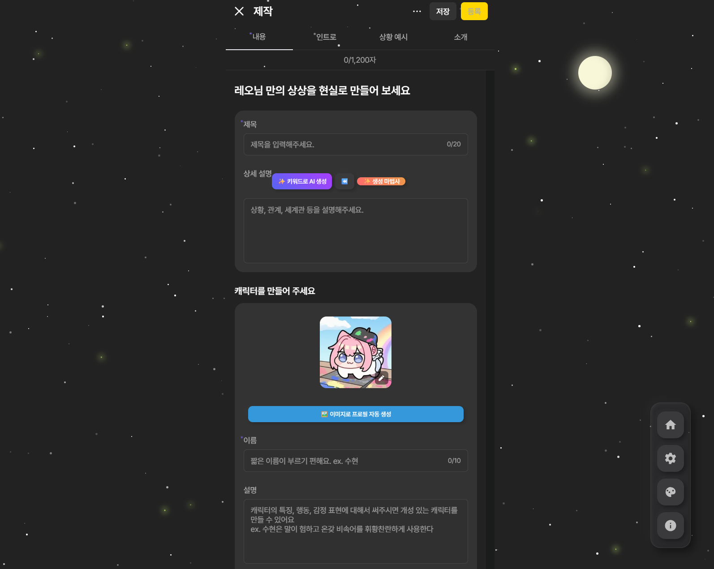

# Theme Park for Zeta

Zeta를 위한 브라우저 확장 프로그램입니다. 다양한 테마와 AI 기반 편의 기능을 제공하여 창작 활동을 돕습니다.
 > 아마 제타에서 제재나 정지를 먹지는 않을 것 같으나, 100%로 확신지을 수는 없는 부분이므로 사용에 주의해 주세요.

---

## 주요 기능

### 비주얼 및 UI 커스터마이징
- **사전 제작 테마:** 디코나 DM 느낌의 사전 테마를 제공합니다.
- **메인 랭킹 분석:** 메인 페이지 -> 추천 페이지에서 기능을 사용할 수 있으며, 랭킹(+알파메일, 유죄남 등등의 모든 섹션) 비교 혹은 단순 출력이 가능합니다.
- **커스텀 테마:** 색상 팔레트를 통해 사이트의 모든 시각적 요소를 직접 수정할 수 있습니다.
  - **AI 팔레트 생성:** 키워드를 입력하면 AI가 어울리는 색상 팔레트를 생성합니다.
  - **테마 코드 공유:** 생성한 테마를 코드로 내보내거나 가져올 수 있습니다.
- **동적 배경 효과:** 불꽃놀이, 눈, 별 등 10여 종의 움직이는 배경 효과를 지원합니다.
- **레이아웃 조정:** 글꼴, 글자 크기, 애니메이션, 컴팩트 모드 등 UI를 세부적으로 조정할 수 있습니다.
- **눈 보호 모드:** 화면에 세피아 톤 필터를 적용하여 눈의 피로를 줄입니다. 강도 조절이 가능합니다.

### 캐릭터 제작 도우미 (Gemini API)
> **주의:** AI 기능은 사용자의 Gemini API 키가 필요합니다. 

- **이미지로 프로필 자동 생성:** 캐릭터 이미지를 기반으로 이름, 외형, 성격, 말투가 포함된 프로필을 YAML 형식으로 자동 생성합니다. '상세 설명'에 세계관이 입력된 경우, 이를 참고하여 생성합니다.
- **AI 프롬프트 도우미:** 캐릭터 설정 페이지의 입력란에 다음 기능들을 제공하는 드롭다운 메뉴를 추가합니다.
  - **자동 완성:** 키워드를 상세한 설정으로 확장합니다.
  - **정보 채우기:** 부족한 부분을 AI가 보강합니다.
  - **관계 생성:** 캐릭터 간 관계 아이디어를 제안합니다.
  - **아이디어 얻기:** 막혔을 때 다음 전개에 대한 힌트를 제공합니다.
- **대화 분석:**
  - **AI 맥락 요약:** 현재 대화의 흐름과 분위기를 요약합니다.
  - **대화 스타일 분석:** 상대 캐릭터의 말투와 성격을 분석합니다.
  - **다음 장면 추천:** 대화에 이어질 만한 장면 3가지를 추천합니다.

### 편의 기능
- **집중 모드:** 채팅과 입력창을 제외한 모든 UI를 숨겨 작업에 몰입할 수 있도록 돕습니다. (아직 버그로 인해 작동 자체는 막아두었습니다.)
- **자동 저장:** 캐릭터 제작 페이지의 내용을 30초마다 자동으로 브라우저에 임시 저장합니다.
- **저장 목록 관리:** 자동 저장된 데이터를 목록에서 확인하고 복원하거나 삭제할 수 있습니다.
- **번역 도구:** UI 내 번역 패널을 통해 텍스트를 번역할 수 있습니다.

---

## 설치 방법

스토어에 등록되지 않은 확장 프로그램이므로, 다음 절차에 따라 개발자 모드로 설치해야 합니다.

1.  이 리포지토리의 코드를 ZIP 파일로 다운로드한 후 압축을 해제합니다.
2.  Chrome 브라우저에서 `chrome://extensions` 페이지를 엽니다.
3.  우측 상단의 '개발자 모드'를 활성화합니다.
4.  좌측 상단의 '압축 해제된 확장 프로그램을 로드합니다' 버튼을 클릭합니다.
5.  1번 단계에서 압축 해제한 폴더를 선택하여 로드합니다.

설치 후 제타에 접속하면 확장 프로그램이 활성화됩니다.

---

## 사용법

- **초기 설정 (API 키):** AI 기능을 사용하려면 Gemini API 키가 필요합니다. Zeta 사이트 우측 하단의 아이콘을 클릭해 설정창을 열고, '기능 및 저장(⚙️)' 탭에서 본인의 API 키를 입력하십시오.
- **제작 페이지 도우미:** 캐릭터 제작 페이지에서 이미지 하단의 '이미지로 프로필 자동 생성' 버튼 또는 설명 입력란 아래의 'AI 도우미' 드롭다운 메뉴를 사용하십시오.

---

## 알려진 제약 사항

- **사이트 구조 의존성:** 이 확장 프로그램은 Zeta.ai의 현재 HTML 구조를 기반으로 작동하므로, 사이트의 대규모 업데이트 시 일부 기능이 작동하지 않을 수 있습니다.
- **API 키:** AI 기능은 사용자의 자체 Gemini API 키를 요구합니다.
- **집중 모드:** 일부 특수한 페이지에서는 집중 모드의 UI 숨김 처리가 완벽하지 않을 수 있습니다.

 

*This is a fan-made project and is not officially affiliated with zeta.ai.*